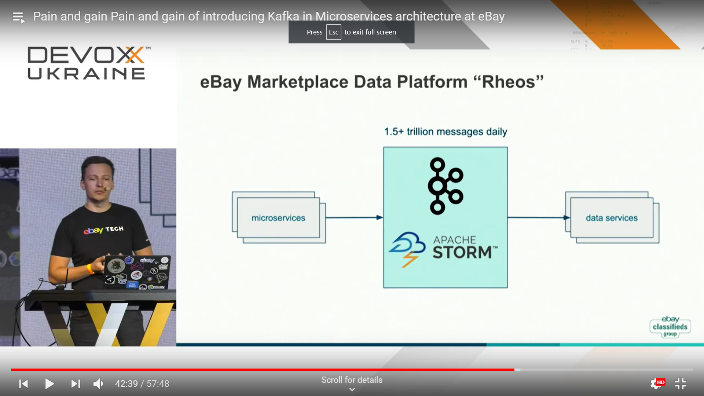
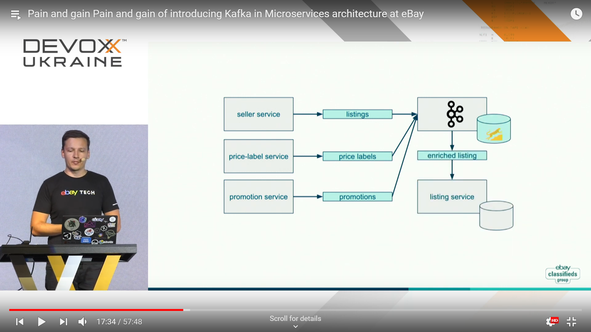
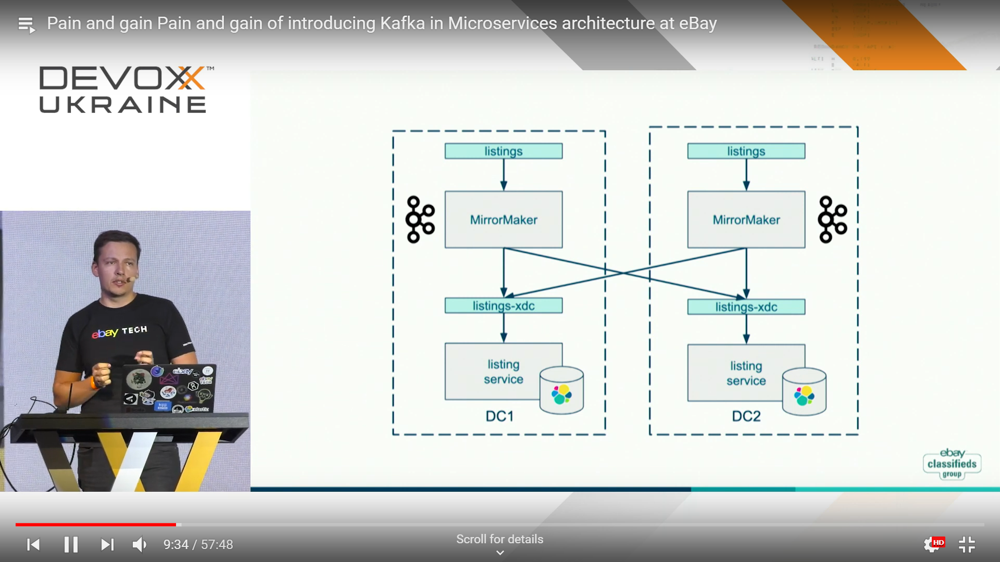
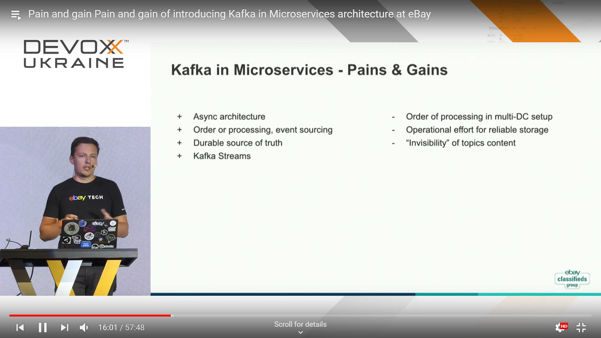

# eBay
## Load

## Architecture

## Technologies
* Kafka
* Kafka Streams

## Other

### Cases

## Where?
Devoxx Ukraine 2019: [Pain and gain of introducing Kafka in Microservices architecture at eBay](../devoxxua-2019/pain-and-gain-of-introducing-kafka-in-microservices-at-ebay.md)

## My notes