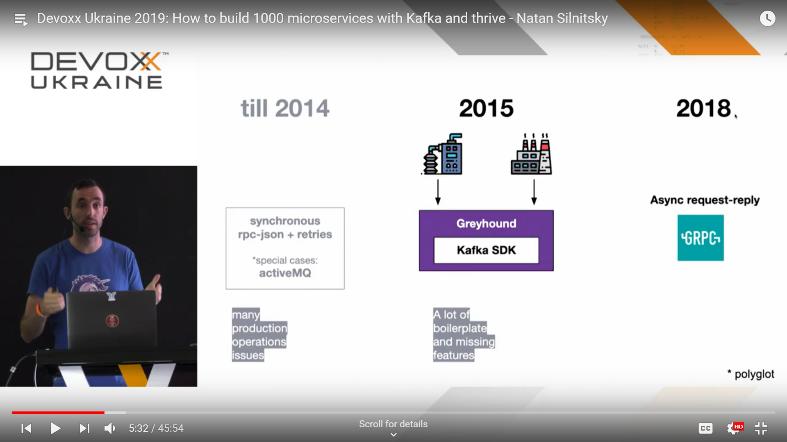

# Wix
## Load

* 270 developers
* 1300 microservices
* 10M LoC
* 850M Kafka messages daily

## Architecture

## Technologies
* Kafka
* Scala (mostly)
* Java
* Node.js

## Other
### Library around Kafka SDK
* Setup boilerplate
* Thread-safe Parallel Consumption
* Scheduled retires * blocking handler
* Resilient Producer
* Context Propagation (headers with information about user)
* Metrics publishing
* Plus UI for manual processing

## Where?
Devoxx Ukraine 2019: [How to build 1000 microservices with Kafka and thrive](../devoxxua-2019/how-to-build-1000-microservices-with-Kafka-and-thrive.md)

## My notes
* Count of Kafka messages talks only about good scalability of Kafka, but not about real load.
It is not possible to compare with other solutions (and will never be possible).